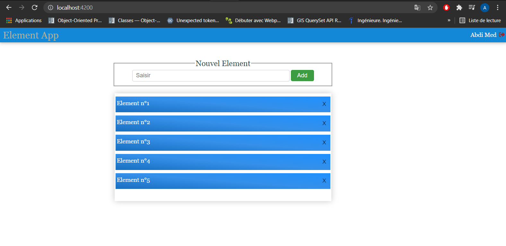

# This is simple app build with angular v11 in client side and django 3.2 it contains:
* A login interface where we use email and password to connect
* A main interface with list of items
* We can create a new item and add it in server 
* delete a item or change its state

## Image of the login interface 

## Image of the main interface where items appear 

